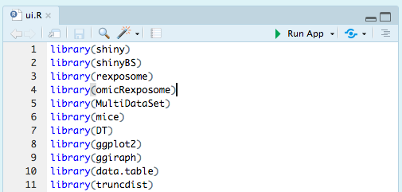

# Setup

In order to download and setup the environment to launch exposomeShiny, the latest version of the software has to be downloaded from GitHub. To do so open a new RStudio session. Run the following code on the console once the working directory has been setup.

```{r setup_chunk_1}
  # Set working directory
setwd(dir = "/some/path/")
      
  # Download zip
download.file(url = "https://github.com/isglobal-brge/exposomeShiny/archive/master.zip", destfile = "master.zip")

  # Unzip the .zip to the working directory
unzip(zipfile = "master.zip")

  # Set the working directory inside the downloaded folder
setwd(dir = "/some/path/exposomeShiny-master")
```

Now all the source files are downloaded to the location of chose and the working directory moved to the correct folder, to start the project, open the `Rproj` file by clicking it on the Files explorer of RStudio.
<center>

</center>

Once the project is loaded, run the following code to install `renv` if it's not present on your R packages library and load the dependencies of exposomeShiny on this R session.

```{r}
install.packages("renv")

renv::restore()
```

Now everything is ready to launch the Shiny application. To do so there a two approaches, one is to open the `ui.R` or the `server.R` files that are inside the `R` folder and press `Run App`.

<center>

</center>

Or the other option is to input the following command on the console.

```{r}
shiny::runApp('R')
```