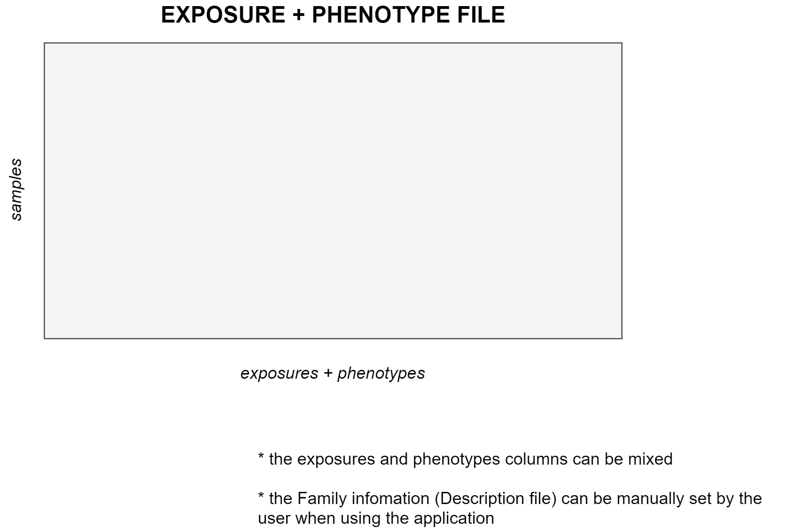

# Data sets

## Exposome dataset
The exposome is composed of three different files (in `*.csv` format). Those files are refered inside the Shiny as exposures, description and phenotypes. Their content is the following:

+ The `exposures` file contains the measures of each exposure for all the individuals included on the analysis. It is a matrix-like file having a row per individual and a column per exposures. It must includes a column with the subject’s identifier.
+ The `description` file contains a row for each exposure and, at last, defined the families of exposures. Usually, this file incorporates a description of the exposures, the matrix where it was obtained and the units of measurement among others.
+ The `phenotypes` file contains the covariates to be included in the analysis as well as the health outcomes of interest. It contains a row per individual included in the analysis and a column for each covariate and outcome. Moreover, it must include a column with the individual’s identifier.

A visual representation of the three matrices and how they correlate is the following.

<center>

</center>

Exposures data file example:

```
id    bde100  bde138  bde209  PFOA    ...
sub01  2.4665  0.7702  1.6866  2.0075 ...
sub02  0.7799  1.4147  1.2907  1.0153 ...  
sub03 -1.6583 -0.9851 -0.8902 -0.0806 ... 
sub04 -1.0812 -0.6639 -0.2988 -0.4268 ... 
sub05 -0.2842 -0.1518 -1.5291 -0.7365 ... 
...   ...     ...     ...     ...
```

Description data file example:

```
exposure  family  matrix         description
bde100    PBDEs   colostrum       BDE 100 - log10
bde138    PBDEs   colostrum       BDE 138 - log10
bde209    PBDEs   colostrum       BDE 209 - log10
PFOA      PFAS    cord blood      PFOA - log10
PFNA      PFAS    cord blood      PFNA - log10
PFOA      PFAS    maternal serum  PFOA - log10
PFNA      PFAS    maternal serum  PFNA - log10
hg        Metals  cord blood      hg - log 10
Co        Metals  urine           Co (creatinine) - log10
Zn        Metals  urine           Zn (creatinine) - log10
Pb        Metals  urine           Pb (creatinine) - log10
THM       Water   ---             Average total THM uptake - log10
CHCL3     Water   ---             Average Chloroform uptake - log10
BROM      Water   ---             Average Brominated THM uptake - log10
NO2       Air     ---             NO2 levels whole pregnancy- log10
Ben       Air     ---             Benzene levels whole pregnancy- log10
```

Phenotypes data file example:

```
id    asthma   BMI      sex  age  ...
sub01 control  23.2539  boy  4    ...
sub02 asthma   24.4498  girl 5    ...
sub03 asthma   15.2356  boy  4    ...
sub04 control  25.1387  girl 4    ...
sub05 control  22.0477  boy  5    ...
...   ...      ...      ...  ...
```

## Plain datasets

If the researcher has gathered all the data on a single file which contains both phenotype and exposure data, this file can be used too. The user interface has a selector for it, more information on the [correspondent section](#plain_data).

A visual representation of a plain dataset is the following.

<center>

</center>

Plain dataset example (3 exposures + 2 phenotypes):

```
id    bde100  bde138  bde209    asthma   BMI      ...
sub01  2.4665  0.7702  1.6866   control  23.2539  ...
sub02  0.7799  1.4147  1.2907   asthma   24.4498  ...  
sub03 -1.6583 -0.9851 -0.8902   asthma   15.2356  ... 
sub04 -1.0812 -0.6639 -0.2988   control  25.1387  ... 
sub05 -0.2842 -0.1518 -1.5291   control  22.0477  ...
...   ...     ...      ...      ...      ...
```

## Omics dataset {#omicsds}

The omics data inputed to the Shiny must be provided as an `*.RData`. This file has to contain an ExpressionSet, which is an S4 object. This object is a data container of the Bioconductor toolset.

For further information on ExpressionSet and how to create and manipulate them, please visit the [official documentation](https://www.bioconductor.org/packages/devel/bioc/vignettes/Biobase/inst/doc/ExpressionSetIntroduction.pdf) and this [ selected vignette](https://kasperdanielhansen.github.io/genbioconductor/html/ExpressionSet.html).