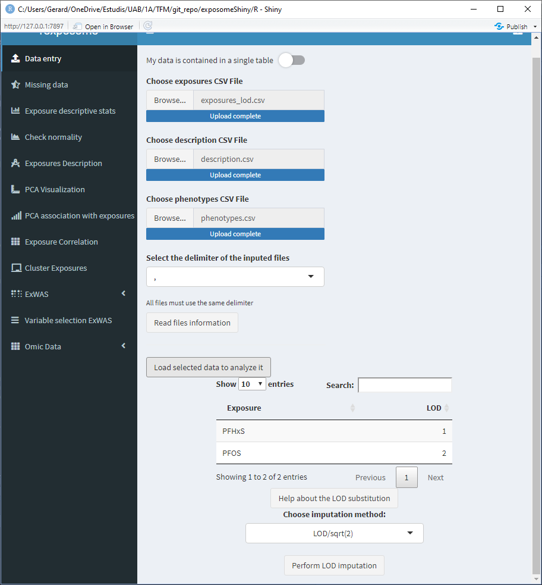
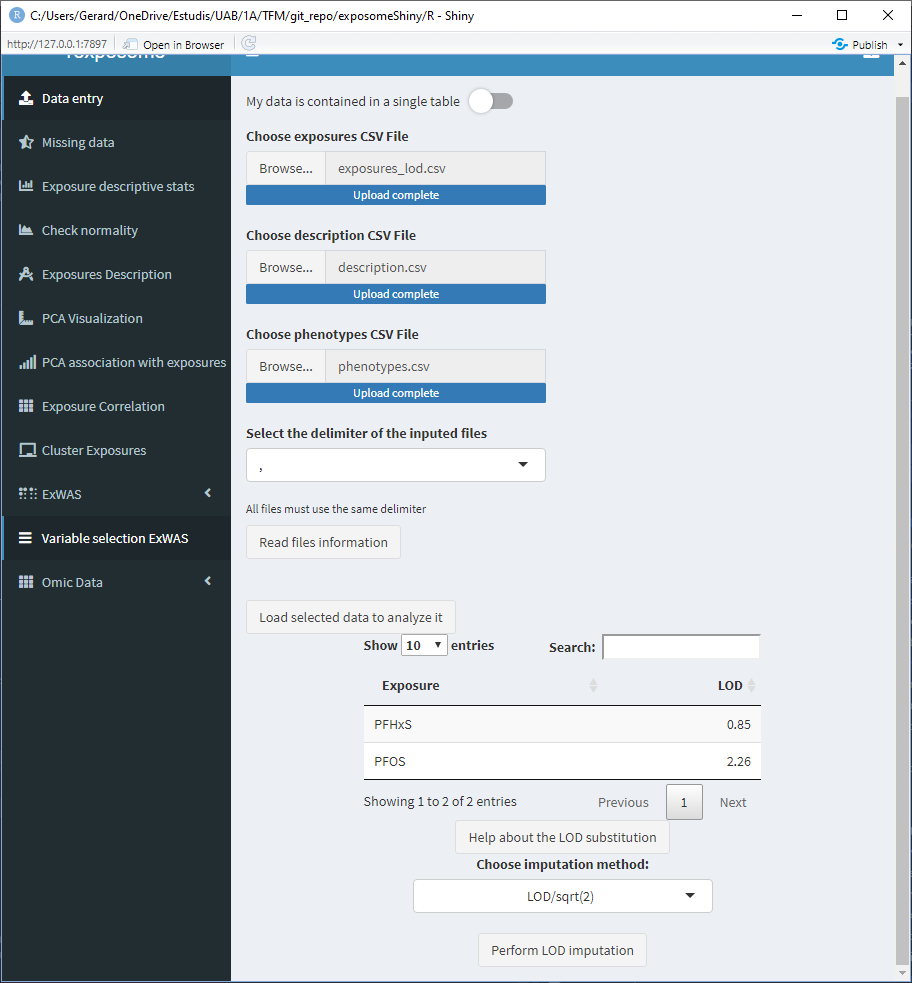
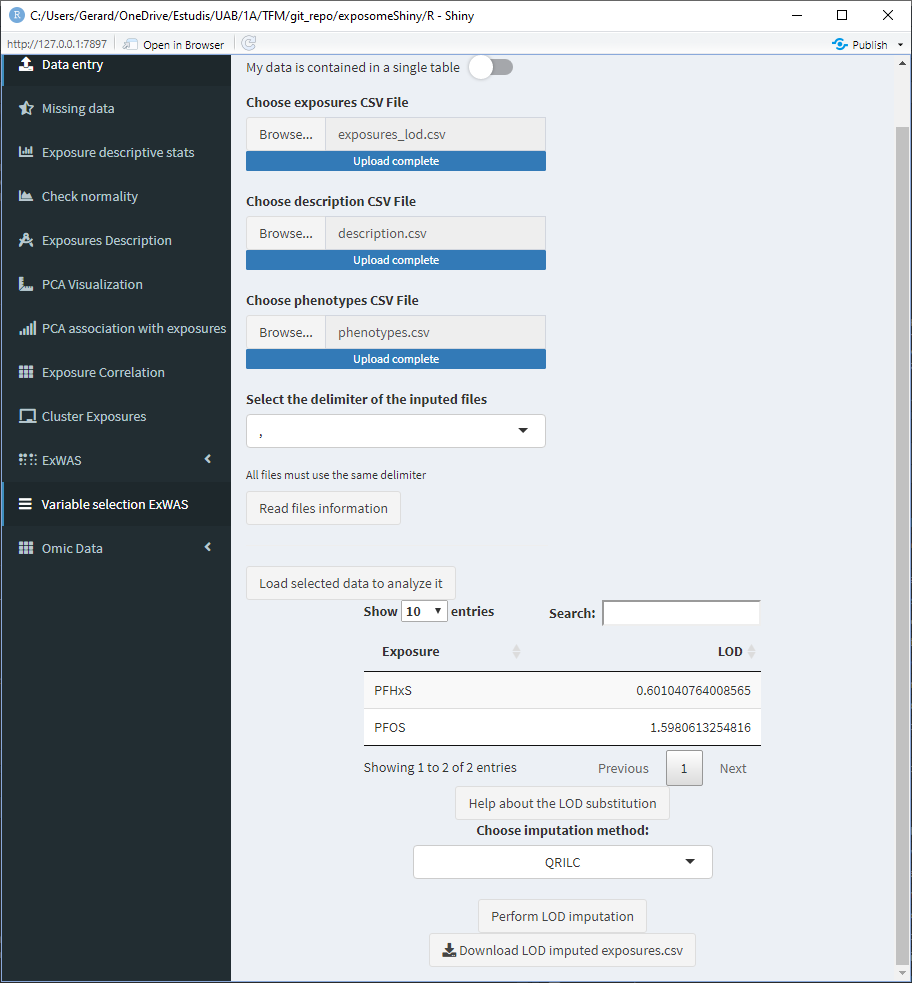
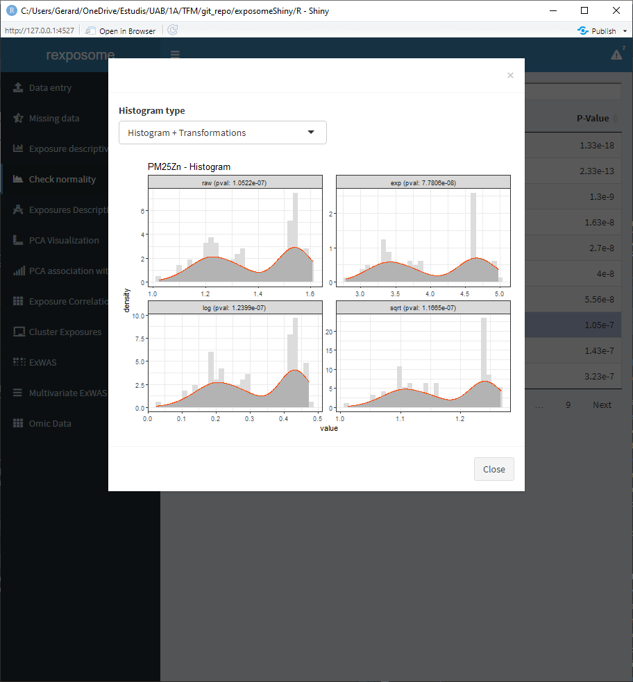
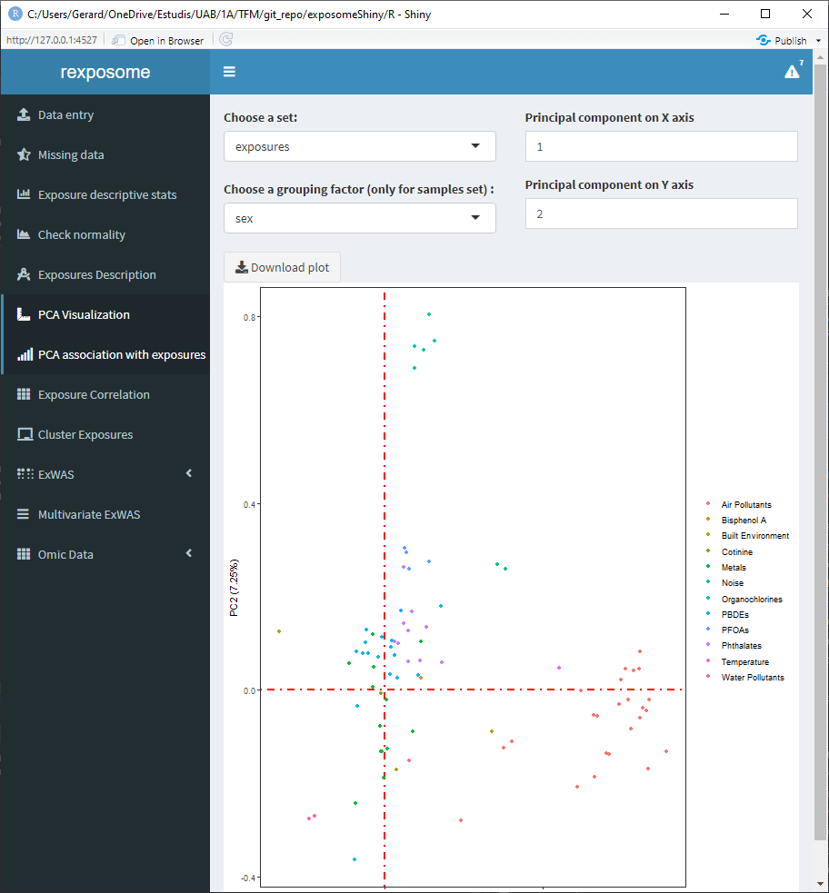
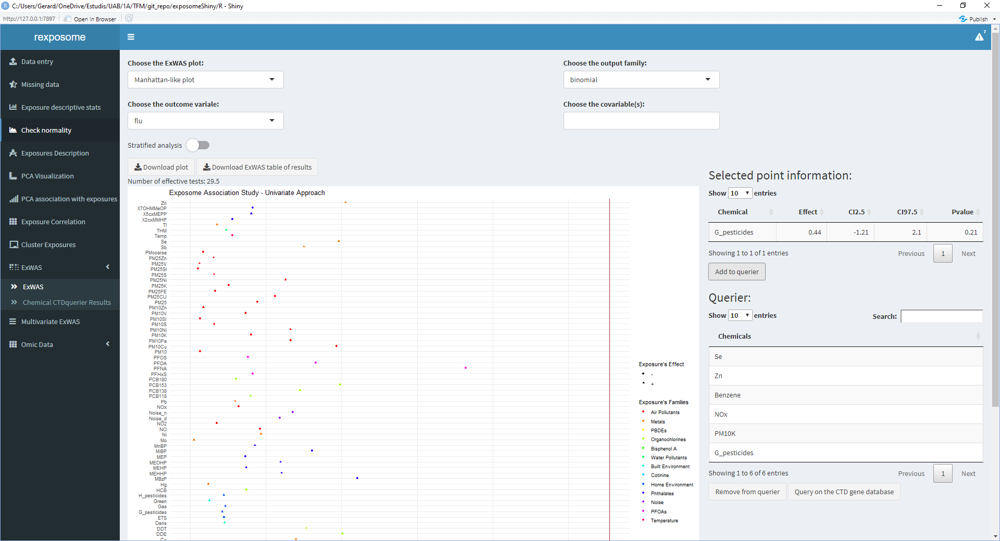
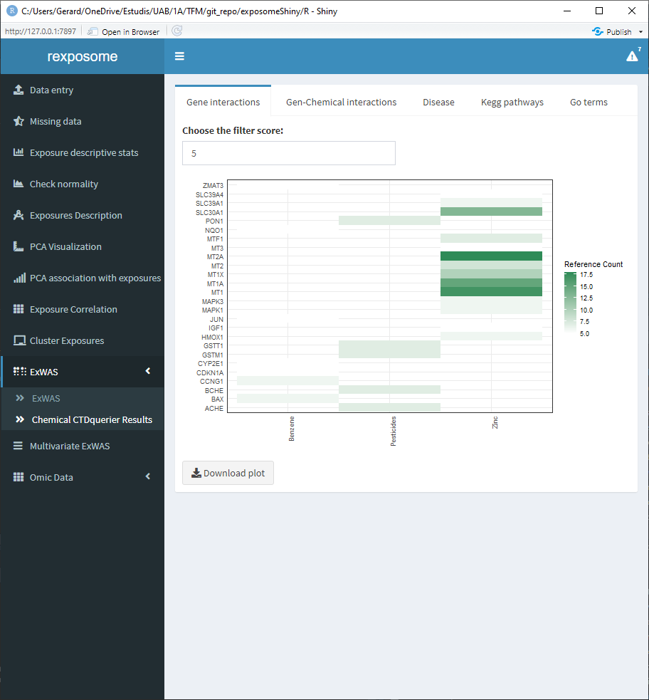
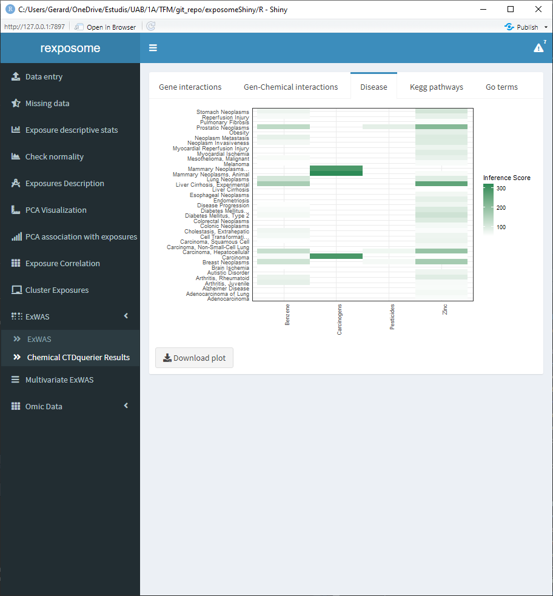
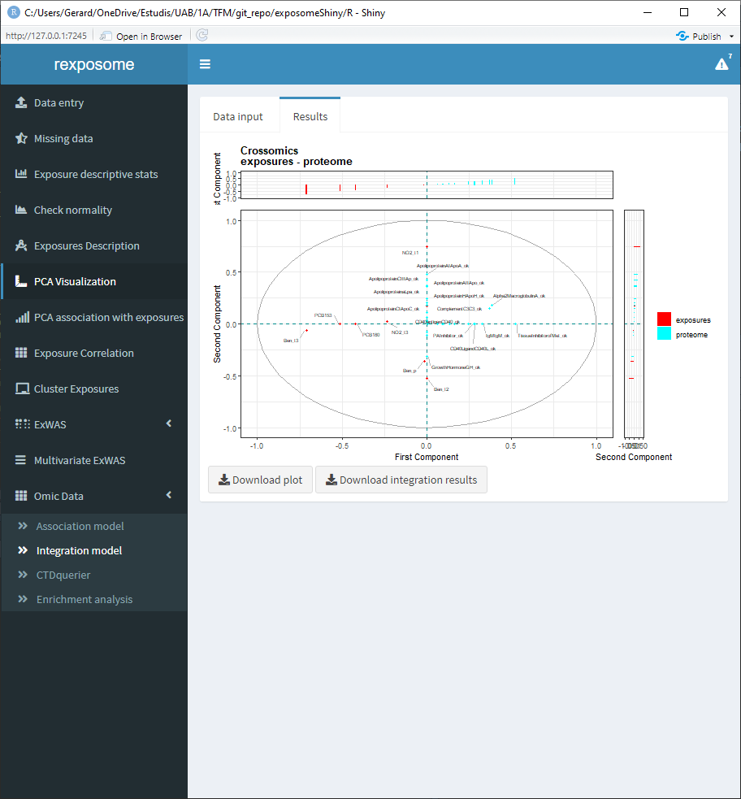
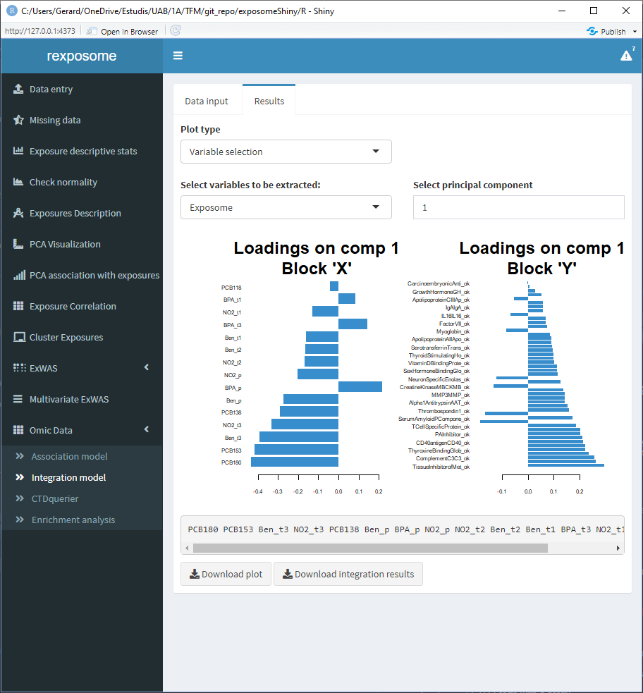

# Analysis flowcharts

On this section, a detailed guide on how to perform different analyses using exposomeShiny will be provided. The guide contains screenshots of the analysis steps as well as some flowcharts.

## Exposome health analysis

The exposome health analysis corresponds to the study of the relation between exposures (exposome) and health outcomes (phenotypes). Information about exposome data exploration and pre-processing can also be found on this subsection. Along this section, the data files used as examples are: `exposures.csv`, `exposures_lod.csv`, `description.csv`, `phenotypes.csv` and `exposome_plain.csv` which are available [here](https://github.com/isglobal-brge/exposomeShiny/tree/master/data).

### Data entry

There are two different data entry methods. [Exposome data](#expo_data) which uses the three tables and [plain data](#plain_data_expl) which only uses one.

#### Exposome data

Three tables are needed to input an exposome dataset: the exposures, description and phenotypes. This files have to be provided as `csv` or `txt`. Different separator formats are supported (',', ';', tabs and spaces). Excel files or R objects are not supported as inputs. Be sure all three files share the same separator.

 

Once the tables are read two new main elements will appear, 1) the option to explore the inputted tables; and 2) six input fields which control the following file parameters:

-   Column name in the *description* file that contains the exposures
-   Column name in the *description* file that contains the families
-   Column name in the *exposures* file that contains the identifier
-   Column name in the *phenotypes* file that contains the identifier
-   The threshold to select between continuous or factor exposures. More than this number of unique items on an exposure will be considered as 'continuous'
-   The encoding to search for limit of detection (LOD) missings. It can be either a number (example: `-1`) or a string (example: `LOD`). All the cells that contain this encoder will be considered LOD missings.

This is illustrated on the following figure.


Once the fields are completed, press the *Validate selections* button in order to check if all the parameters allow for a successful load of the exposome dataset, if not, a pop-up will be prompted to the user with the R error message that stopped the execution. In the case that everything is correct, the interface will be updated and a button that reads *Load selected data to analyze it* will appear, by clicking this button the dataset will be loaded.


#### Plain data {#plain_data}

When dealing with a single file that contains the exposures and phenotype data, press the "My data is contained in a single table" toggle. This will change the interface to only show one file selector.

<center>


</center>

Select a file and press "Read file information". This will change the interface to show a multiple selector input, all the available columns will be listed, select the ones which correspond to phenotypes.

<center>


</center>

When all the phenotypes are selected, press "Confirm". Now the exposures can be grouped into families, to do so:

+ Select all the exposures from the same family
+ Write the family name on the box "Family of selected exposures"
+ Press the "Assign" button

The table will be updated to visualize the action performed.

Exposures left with an empty "Family" field will be treated as they are their own family.

<center>


</center>

Finally, there are two configuration fields:

-   The threshold to select between continuous or factor exposures. More than this number of unique items on an exposure will be considered as 'continuous'
-   The encoding to search for limit of detection (LOD) missings (example: `LOD`). All the cells that contain this encoder will be considered LOD missings.

Be sure to revise them before pressing "Load data".

### LOD imputation

<center>


</center>

When loading the data, if LOD missings are detected a small table with the exposures that have LOD missings will appear at the bottom of the "Data entry" page.



This table has a column named "LOD", which by default reads as 1, 2, 3, ... Those values are meant to be modified by the user and input the limit of detection values for the different exposures. Those values will be used if the LOD imputation method is LOD/sqrt(2). If the imputation method used is QRILC there is no need to modify those values, as they won't be used.

To modify the LOD values of the table, double click on the cell of interest and type the value (use points for decimal separation e.j. 1.156).



After clicking "Perform LOD imputation", a new button to download the imputed dataset will appear, this will download the exposures data with the LOD missings imputed.



Once the LOD imputation is completed, the exposome dataset that will be used on the following steps is imputed.

### Missing imputation

<center>


</center>

The "Missing data" tab displays a plot with the percentages of missing data for each exposure.


The missings can be imputed using Multiple Imputation by Chained Equations (MICE) by clicking the "Impute missing values using mice" button. 

Please note that missings imputation might require other methodologies or more fine control. If that is the case, we encourage users to impute the data beforehand and input to our application data that is already imputed.

Once the missings imputation is completed, the exposome dataset that will be used on the following steps is imputed. This is reflected by refreshing the plot, which should read 0% missings for all exposures.

 

The imputed exposures set can be downloaded as a `*.csv` file.

### Exposures description

The exposure descriptive stats tab, provides a table with the main descriptive stats of the quantitative exposures. The descriptive stats (per exposure) included on the table are:

-   Number of values
-   Number of NULLs
-   Number of NAs
-   Minimum
-   Maximum
-   Range of values
-   Sum of values
-   Median
-   Mean
-   Standard Error of mean
-   0.95 confidence interval of the mean
-   Variance
-   Standard deviation
-   Variance coefficient

Remember that after imputing the missings, the imputed dataset becomes active, this will be reflected showing 0 NAs for example.


### Normality correction

<center>


</center>

The table shown on the 'Check normality' tab contains all the exposures, if they can be considered normal distributed and the p-value of the normality test (Shapiro-Wilk).


Select an exposure from the table and click on 'Plot histogram of selected exposure' to see the histogram of that exposure.


There is the option to visualize the histograms with the available transformations applied, in order to see how an exposure will be affected by them. To see it select 'Histogram + transformations' on the Histogram type.



Aside from visualizing if exposures are normal, this tab can be used to apply transformations to the exposures. The available transformations are "log" (default, natural logarithm), "\^1/3" and "sqrt". To do so, the procedure is the following:

+ Press the 'Show false' button. A pop-up will appear with a table. This table contains all the exposures that did not pass the normality test, next to the exposures the transformation to be applied is shown.


+ Modify the transformation method by double clicking on the cell to be changed and typing the required method. Input 'none' if no transformation is desired for a certain exposure.


+ Press 'Normalize' to apply the transformations.

After the transformations are applied, the table of normality tests will be updated. The dataset used after transforming is updated with the new values.

### Exposures description

<center>


</center>

On the 'Exposures description' tab, exploratory analysis of the exposures can be performed. Again, the data analyzed by this tab will be imputed or normalized if the user has performed it before.

There are three input fields to obtain different plots:

+ Family: To define which family of exposures wil be plotted
+ Grouping factor: Qualitative phenotype to group the exposures
+ Second grouping factor: Second qualitative phenotype to group the exposures

The visualization is different for categorical and quantitative exposures.

Some examples:

#### Quantitative family, grouped by sex


#### Qualitative family, grouped by sex


#### Quantitative family grouped by sex and flu diagnosis (binomial factor)


### PCA Analysis

<center>


</center>

On the 'PCA visualization' tab, the results of a PCA analysis on the exposome data is displayed. 

There are some input fields to modify the plot:

+ Set: Select 'all' to see an array of four plots with different PCA related information. There is also the option of selecting 'samples' and 'exposures' to only display those two plots on a bigger scale.
+ Grouping factor: To group the 'samples' set using a qualitative phenotype.
+ Principal components: By default the first and second principal components are used for the plots. They can be changed using those inputs, which affect all the plots.

#### Set: 'all'


#### Set: 'samples' grouped by sex


#### Set: 'exposures'



Moreover, there is an additional PCA visualization tab named 'PCA association with exposures'. On this tab there are two heatmap plots available.

+ Association of the exposures to the principal components


+ Association of the phenotypes to the principal components


The values of this heatmaps can be visualized as tables by clicking on 'Visualize as table' and be downloaded as `*.csv`.


### Correlation of exposures

<center>


</center>

Displaying the correlation of the exposures can help to visualize intra and inter family relations between the exposures, for that reason there are two different visualization options, the circos and the matrix.

The correlation is computed using Pearson method for numerical-to-numerical correlation, Cramer's V for categorical-to-categorical correlation and linear models for categorical-to-numerical.

#### Matrix plot


#### Circos plot


### Clusterization of exposures


The clusterization of exposures uses a hierarchical clustering algorithm to classify the individuals profiles of exposures in k groups, where k can be selected by the user. The plot shows the profile for each group of individuals.


### ExWAS

<center>


</center>

There are two ExWAS methods implemented, the regular and the stratified. The difference is that the stratified performs multiple ExWAS subsetting the data with a quantitative phenotype (example: ExWAS with male data and ExWAS with female data).

To perfom an ExWAS enter the required fields:

+ Outcome variable: Output phenotype
+ Covariable(s): Adjusting phenotype(s)
+ Output family: Family of the outcome variable (Gaussian/Binomial/Poisson)
+ Type of plot: Manhattan / Effects

#### Regular ExWAS. Outcome: flu, Covariable: Sex, Family: Binomial


#### Stratified ExWAS. Outcome: flu, Cobariable: None, Family: Binomial, Stratifying variable: Sex


The plots and results table can be downloaded. The results table contains the exposure names, association pvalue and effect (with CI 95% for the effect). For the stratified ExWAS, the results table is actually a `*.zip` file with a file for each subset.

### ExWAS - CTDquerier

<center>


</center>

The ExWAS analysis can reveal high association between health outcomes and exposures. To obtain further information (from the CTD database) on exposures of interest:

1. Perform the ExWAS
2. Click on the exposure of interest on the plot
3. A table with information about the selected exposure will appear on the right


4. If the exposure shown on the right table is of interest, click on 'Add to querier'


5. Repeat 2/3/4 for all the exposures of interest



6. Once all the exposures of interest are on the 'Querier' table, click 'Query on the CTD gene database'

The results of this query can be visualized on the 'Chemical CTDquerier Results'. There are five visualization options:

#### Gene - chemical interactions




#### Disease relation



#### Kegg pathways


#### Go terms


### Variable selection ExWAS

Variable selection ExWAS applies elastic net (LASSO regression) to the exposures given a health outcome of interest. The resulting heat map is coloured with the coefficient of each exposure in relation to the health outcome, so the ones in white are not associated. The two columns of the heat map correspond to the minimum lambda (`Min`) and to the lambda which gives the most regularized model such that error is within one standard error of the minimum (`1SE`).

<center>


</center>

To perform a variable selection ExWAS study, check the Variable selection ExWAS tab and select the desired output parameter, click on run model to generate the plot.

This analysis requires data without missings, so if there are missings MICE imputation is applied beforehand. After the model is fitted, the imputed dataset will be removed.

 

The table of results and plot can be downloaded.

## Exposome-Omic analysis

The aim of this analysis is to perform an association test between the gene expression levels and the exposures. The datasets used in this section are `exposures.csv`, `description.csv`, `phenotypes.csv` and `gene_exp.Rdata` which are available [here](https://github.com/isglobal-brge/exposomeShiny/tree/master/data).

It's important noting that (by default) the maximum size of the omics data is 30 MB, if the omics file to be analyzed is bigger, change the line number 2 of the `server.R` file.

```{r}
  # the "30" refers to 30MB, change as needed
options(shiny.maxRequestSize=30*1024^2)
```

### Association analysis

<center>


</center>

First, make sure that the exposome dataset is loaded. Then, proceed to loading the omics data, which should be providad as a `*.RData`.


This type of analysis is usually very computationally intensive, so it's useful to be able to limit the scope. The exposome data can be subsetted by families for that reason. If all the families are desired don't input any and proceed to click the "Subset and add".


Select the variables for the association analysis (linear models) and if SVA (surrogate variable analysis) is wanted on the "Association model" subtab.


Once complete, there are various tabs to visualize the results.

The "Results table" shows the gene, log of the fold change, p-value and adjusted p-value.


The "Significant hits" shows the exposure, hits and lambda.


The QQ Plot shows a QQ plot (expected vs. observed -lo10(p-value)) for the selected exposure.


The Volcan plot shows a volcano plot (log2(fold change) vs -log10(p-value)). For this plot there are two input cells to adjust the horizontal and verital limit lines to filter out the results.


### CTD querier


The association analysis of exposome data and omic data may point some genes of interest. Information about these genes can be queried on the CTD database.

To do so:

1. Perform association analysis
2. Go to the volcano plot visualization
3. Select one point. This will update the 'Selected point information' table at the bottom


Sometimes multiple points may be very close, so this table will show information about them


4. Select the point of interest from the 'Selected point information' table and click on 'Add to querier'. This will the search of the gene related to the selected SNP. Sometimes the search may not yield a resulting gene.


5. Repeat 3/4 for all the points of interest


When all the genes of interest are on the querier, move to the 'CTDquerier' tab. On it, the genes to be queried can be visualized before performing the query. Once the query is performed, the results can be visualized on the different tabs.


There are six tabs showing different results interpretations. First there's the "Lost & found" tab which a plot to see the amount of genes found on the CTD database and the ones that were not found , there's also two lists stating the names of them.


The diseases tab shows a table of all the associated diseases found on the CTD database.


The curated diseases tab shows the table of associated diseases but only shows the ones with direct evidence.


The association tab shows information about all the direct evidence associated diseases. Select the disease of interest to see the score and reference count of it.


The inference score tab shows the inference score for each gene for a selected disease, the filter parameters puts out the genes with an inference score lower than the selected filter.


The association matrix tab shows a matrix of genes vs. chemicals with a heatmap representing the existing papers (references) providing evidence about the association between chemicals and genes.


### Enrichment analysis


To perform an enrichment analysis, select the genes of interest by following the same procedure as with the CTDquerier.

After selecting them, go to the "Enrichment analysis" tab, on it there is a selector to choose between GO and KEGG databases and a threshold selector for the cutoff pvalue of the enrichment analysis. 


When the enrichment analysis is performed, there are multiple visualization tabs for the results, the first one is a table with the plain results, which can be downloaded.


The following four tabs correspond to different visualization options for the results. All of them can be downloaded.


## Exposome-Omic integration (e.g. crossomics)

The datasets used in this section are `exposures_2.csv`, `description_2.csv`, `phenotypes_2.csv`, `brge_gexp.rda` and `brge_prot.rda` which are available [here](https://github.com/isglobal-brge/exposomeShiny/tree/master/data).


The relation between exposures and omic-features can be studied from another perspective, different from the association analyses. The integration analysis can be done, using multi canonical correlation analysis, multiple co-inertia analysis or partial least squares (this method only is supported with one omics dataset). The first method is implemented in R package `PMA` (CRAN) and the second in `omicade4` R package (Bioconductor). The PLS uses the `mixOmics` R package (Bioconductor).

Before conducting an integration model, an exposome dataset has to be loaded into the Shiny application.

For the MCIA and MCCA options, the exposome dataset can't contain missings, so it needs to be imputed beforehand. For the PLS there can be missings. Different visualizations are provided for each method, as the used R packages provide different visualization tools, all three methods generate different plots. The Rdata object that contains the results can be downloaded to be explorated by the user on a separate R session.

The differences between association and crossomics are that the first method test association between two complete data-sets, by removing the samples having missing values in any of the involved data-sets, and the second try to find latent relationships between two or more sets.

The initial page of the integration is the following.


The user has a field to select a omics file and a 'Type of file' field. This text field is to input whether the selected data is expression/proteome/... this field will be used for informative purposes when displaying the results.

If more than one omics dataset is going to be used on the integration, click on 'More data' to get additional input fields, remember that only MCIA and MCCA accept more than one omics dataset.


Once the data entry is completed, click on 'Load data and perform integration'. Go to the results page to see the plots of the integration.

The following screenshots are the results of an integration analysis using the exposome dataset (`exposures_2.csv`, `description_2.csv`, `phenotypes_2.csv`) with the missings imputed (using the 'Missing data' tab of the Shiny) expression omics (`brge_gexp.rda`) and proteome omics (`brge_prot.rda`). All this mentioned datasets can be found [here](https://github.com/isglobal-brge/exposomeShiny/tree/master/data).

### Integration using MCIA


### Integration using MCCA (using only the proteome omics)



### Integration using PLS (using only the proteome omics)

There are multiple visualization options for the PLS integration.

#### The exposures space

Can be grouped using the categorical phenotypes of the exposome data


#### The variables space


#### A correlation heatmap

Available for the first three principal components


#### Loading plots (coefficients of each variable)

Available for the first three principal components



All plots can be downloaded individually, also, the Rdata file that contains the results of the integration can be downloaded.


