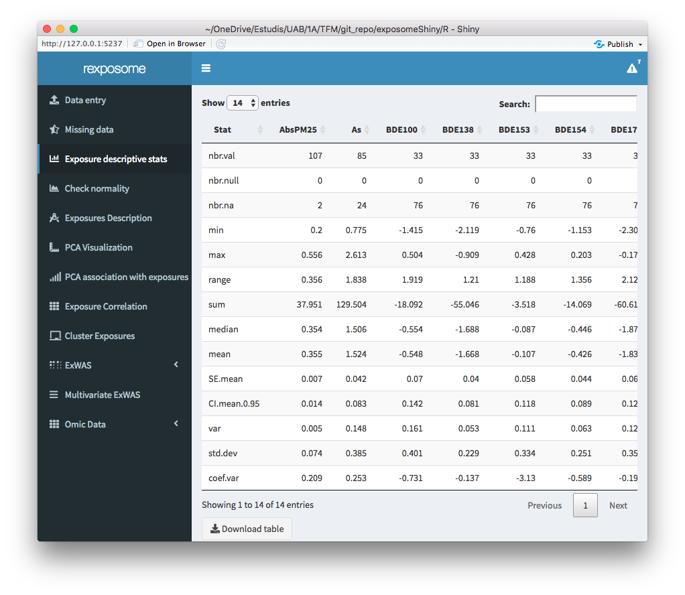
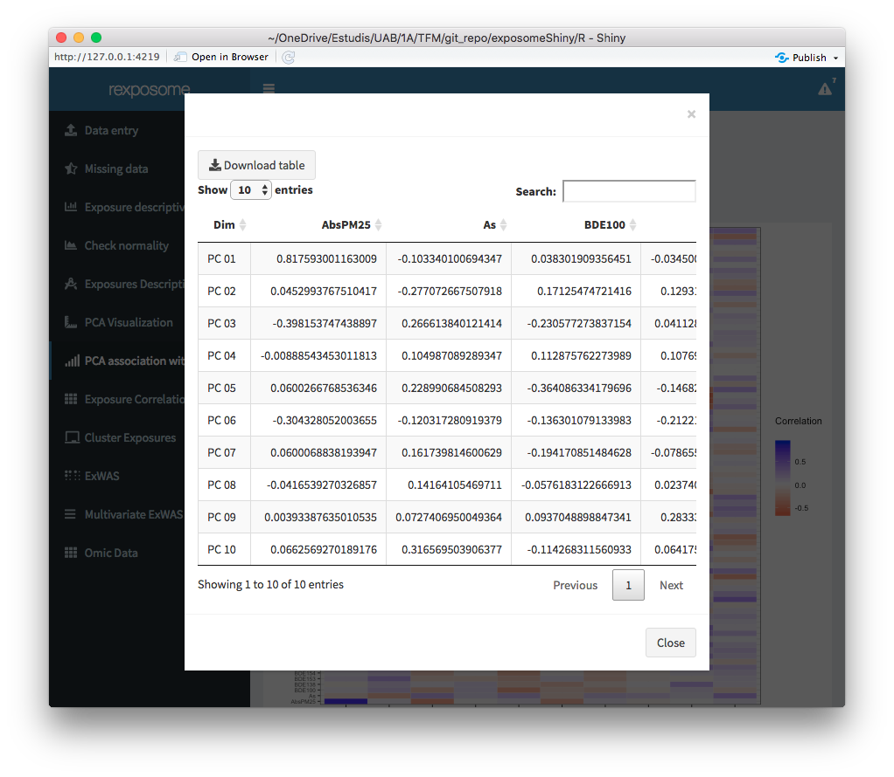
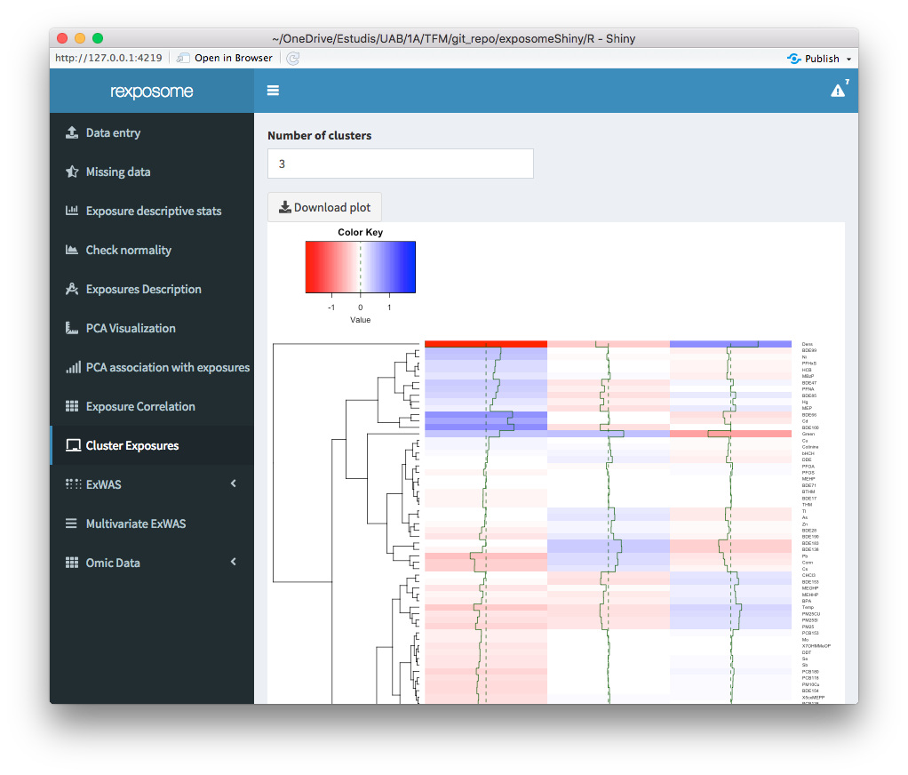
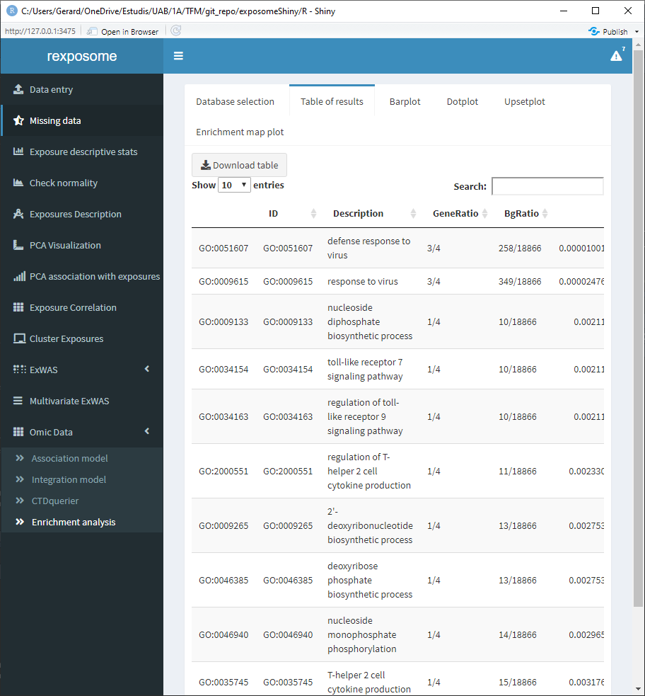
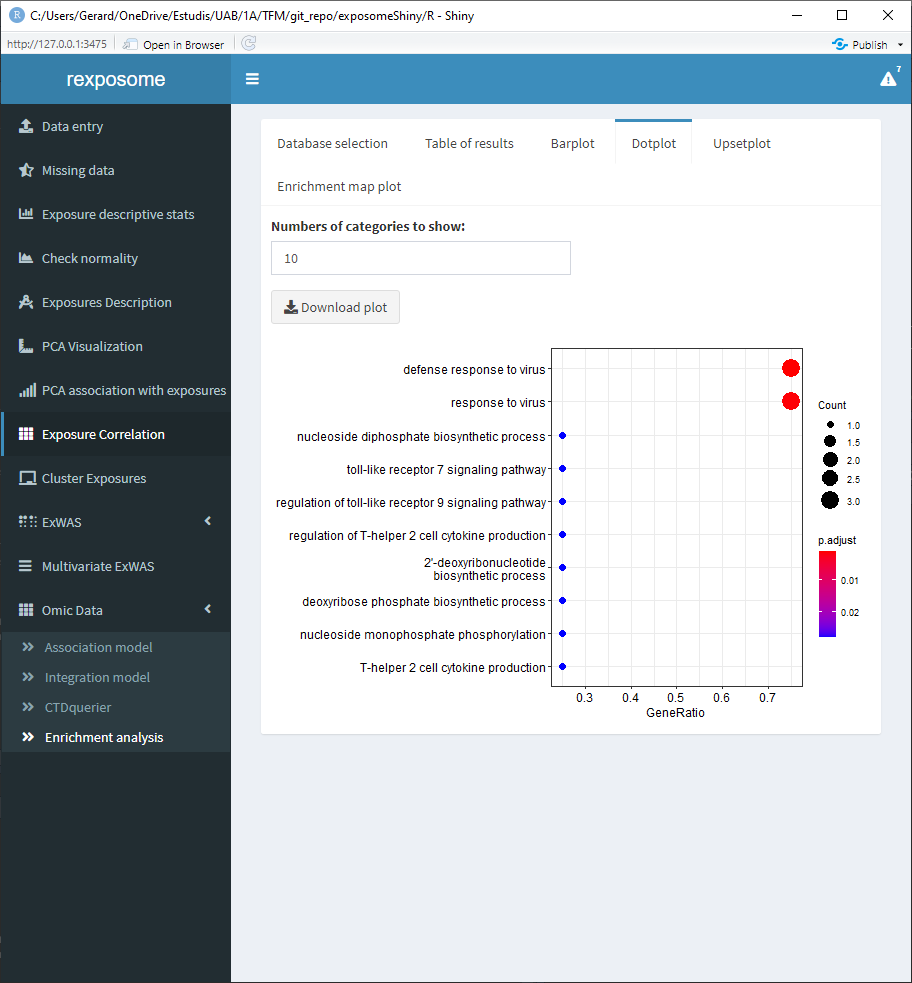
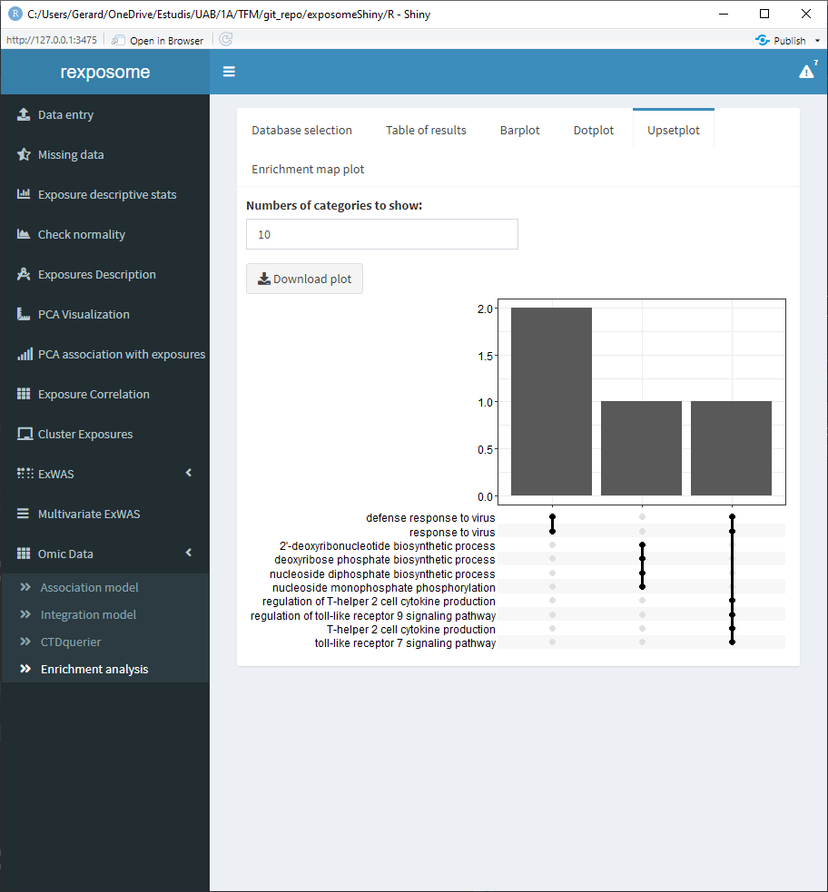
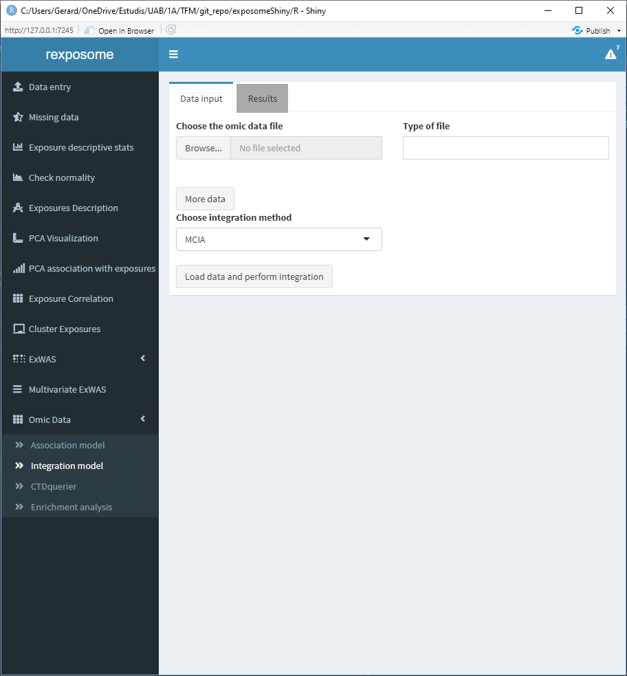

# Analysis flowcharts

## Exposome health analysis

As any user would need to do using the Bioconductor packages (rexposome, omicRexposome and CTDquerier) when performing an analysis using an `R` script, there is some kind of flow (or pipeline) to follow in order to get to the results, this is also true on exposomeShiny, even though it's a seamless and codeless integration of the packages there's still some need for a flowchart to get the desired results. All the required flowcharts will be detailed with a box flowchart as well as screenshots of exposomeShiny in order to provide extra guidance if needed.

### Data entry

#### Exposome data

Input the exposures, description and phenotypes files and load them into the application. This files have to be provided as `csv` or `txt`, there is a selector on the UI to select the type of separation used, it can be either commas, semicolons or tabs/spaces. Excel files or R objects are not supported as inputs.

 Once the tables are read two new main elements will appear, 1) the option to explore the inputted table, using a selector of the table and a button to trigger the visualization; and 2) six input fields will appear on the right side of the file browsers, they are to select the following parameters:

-   Column name in the *description* file that contains the exposures
-   Column name in the *description* file that contains the families\
-   Column name in the *exposures* file that contains the id's
-   Column name in the *phenotypes* file that contains the id's
-   The treshold of to select between continuous or factor exposures. More than this number of unique items will be considered as 'continuous'
-   The encoding to search for limit of detection (LOD) missings. It can be either a number (example: `-1`) or a string (example: `LOD`).

This is illustrated on the following figure.


Once the fields are completed, please press the *Validate selections* button in order to check if all the parameters allow for a successful load of the exposome dataset, if not, a pop-up will be prompted to the user. In the case that everything is correct, the UI will be updated and a button that reads *Load selected data to analyze it* will appear, by clicking this button the dataset will be loaded and the analysis can begin. The input fields are still visible past this point for the case that the user wants to load a new dataset into the application without restarting it.

#### Plain data {#plain_data}

When dealing with a single file that contains the exposures and phenotype data, press the "My data is contained in a single table" toggle. This will change the interface to only show one file selector.

<center>


</center>

Select a file and press "Read file information". This will change the interface to show a multiple selector input, all the available columns will be listed, select the ones which correspond to phenotypes.

<center>


</center>

When all the phenotypes are selected, press "Confirm". Now the researcher can group the exposures into families, to do so, select them on the table, input the family name on the field "Family of selected exposures" and press "Assign". All the exposures that have empty "Family" fields will be treated as they are their own family.

<center>


</center>

Finally, there are two configuration fields:

-   The treshold of to select between continuous or factor exposures. More than this number of unique items will be considered as 'continuous'
-   The encoding to search for limit of detection (LOD) missings. It can be either a number (example: `-1`) or a string (example: `LOD`).

Be sure to revise them before pressing "Load data".

### LOD imputation

<center>


</center>

If exposomeShiny detects LODs (limit of detection) on the exposures file, it will prompt the table with the exposures with LOD and double clicking on the desired cell will enable edit mode to input the instrument LOD. There's also the option of selecting "Random imputation" on the imputation method in order to imputate with random values (truncated log distribution) instead of LOD/sqrt(2). If the user imputes the LOD missings, the dataset will be imputed and the user will not need to reimport it, the loaded dataset will be updated to have the LOD missings imputed, this can be checked by clicking on the `!` symbol at the top bar of the application.


### Missing imputation

<center>


</center>

Once the dataset is loaded into the Shiny, look at the "Missing Data" tab to check the percentages of missing data for each exposure present.


To impute the missing values select "Impute missing values using mice" (Multiple Imputation by Chained Equations), no other method of imputation is available in the software at the moment. After the process finishes, the expect output should be a new missing data graph where there's no missing of any exposure.

 The new imputed exposures set can be downloaded as a `*.csv` file, please note that the downloaded file just assigns numbers to the `idnum` column, if the data you are using has different `idnum` format it's needed to format it properly so that it matches the `idnum` on the phenotypes input file when inputting it to the Shiny.

### Exposures description

There's the option of visualizing the main descriptive stats of the exposures dataset, available for quantitative exposure varibables. The descriptive stats (per exposure) included on the table are:

-   Number of values
-   Number of NULLs
-   Number of NAs
-   Minimum
-   Maximum
-   Range of values
-   Sum of values
-   Median
-   Mean
-   Standard Error of mean
-   0.95 confidence interval of the mean
-   Variance
-   Standard deviation
-   Variance coefficient

This table will have the descriptive stats of the loaded dataset, this means that if the user has imputed the missings (remember that after imputing the missings, the imputed dataset becomes active) it will be reflected on the table as it will show 0 NAs.



### Normality correction

<center>


</center>

Once the dataset is loaded into the Shiny, look at the "Check Normality" tab to check which exposures are not normal (Normality = false), this are the results of Shapiro--Wilk testing. By selecting from the table the desired exposure and clicking the "Plot histogram of selected exposure", as the label of the button implies, a histogram of the selected exposure from the table can be seen.


There is also the option of visualizing the histogram for the implemented transformations along the normality test p-value for said transformations.


By clicking the "Show false" button, all the non normal exposures are listed with the method that will be applied to normalize, this table can be edited (the "Normalization method" column) by double clicking on the desired row. There are three possible methods to use, "log" (default, natural logarithm), "\^1/3" and "sqrt". If no method is desired to be applied to an exposure (keep the original variable) input "none". The normalization method refers to applying X function to a column of the exposures tables, to transform it.


Click "Normalize" and the normalization method selected will be applied, the table on the "Check Normality" tab will be updated with the results of the normalization.

### Exposures description

<center>


</center>

To see all the insights of the exposures dataset loaded into the Shiny, once loaded it check the exposures description tab, there are three options to dig into the dataset, the family (family of the exposure) to visualize and two grouping factors (phenotypes).


### PCA Analysis

<center>


</center>

To see the results of a PCA (principal component analysis) study, load the data and check the PCA Visualization tab, there a set and grouping factor can be choose, it's important noting (as it's already stated on the Shiny) that the grouping parameter only works when the set is selected to "samples". There are also selectors to choose which principal component to visualize on each axis, 10 principal components are computed.


If the association of the PCA analysis with the exposures is desired to visualize, check the "PCA association with exposures" tab, there are two grouping methods to visualize, the phenotypes to principal components and the exposures to principal components.


By clicking on "Visualize as table", the table corresponding to the selected association will be prompted on a pop-up window, this table can be downloaded as a csv.



### Clusterization and correlation of exposures

Displaying the correlation of the exposures can help to visualize intra and inter family relations between the exposures, for that reason there are two different visualization options, the circos and the matrix.

The clusterization of exposures uses a hierarchical clustering algorithm to classify the individuals profiles of exposures in k groups, where k can be selected by the user. The plot shows the profile for each group of individuals.

<center>


</center>

To see the results of the exposure correlation and clustering, select the corresponding tab to each analysis. For the exposure correlation analysis there are two visualizations, the matrix representation and the circos. The correlation uses Pearson method for numerical-to-numerical correlation, Cramer's V for categorical-to-categorical correlation and linear models for categorical-to-numerical.




### ExWAS

<center>


</center>

#### Regular

To perform an ExWAS (exposome-wide association, univariate test of the association between exposures and health outcomes using generalized linear models) study, check the ExWAS tab and select the addecuate parameters for the ExWAS plot, there are two different plot representations, the output variable to choose (phenotype), the output family and as many covariables (phenotypes) as the user wants. There are internal checks to advise the user on which parameters to select depending if the selected outcome is numerical or bionomial.


#### Stratified

There is an option to perform a stratified ExWAS, to do so, check the toggle "Stratified analysis", this will display a new input field to select a categorical phenotype to stratify by. This analysis will yield as many ExWAS plots as levels has the category selected, when downloading the table of results for a stratified analysis, a *.zip* file will be downloaded with a table corresponding to each plot. The naming of the tables corresponds to the stratifying variable with the category name attached (`sex_female.csv` / `sex_male.csv` in the presented case).


### ExWAS - CTDquerier

The ExWAS tab also is able to perform a CTD query of the desired chemicals.

<center>


</center>

To perform a CTDquerier of chemicals with the results of the ExWAS, click on the desired exposure to preload it into the query, when clicked, a chemical name with it's associated P-Value will appear on the table on the right, if that's the desired chemical to add to the query list click "Add to querier". In the case of adding an unwanted chemical to the query list, select it (or them) by clicking on the Querier list and click on "Remove from querier".


To do the query of the chemicals to de CTD database click on "Query on the CTD gene database" and see the results on the "Chemical CTDquerier Results" subtab. It's important noting that on the "Kegg pathways" and "Go terms" the input field corresponds to the negative exponent of the filter.


### Multivariate ExWAS

Multivariate analysis using Elastic Net (LASSO regression). Multivariate ExWAS applies elastic net to the exposures given a health outcome of interest. The heat map is coloured with the coefficient of each exposure in relation with the health outcome, so the ones in white are not interesting. The two columns of the heat map correspond to the minimum lambda (`Min`) and to the lambda which gives the most regularised model such that error is within one standard error of the minimum (`1SE`).

<center>


</center>

To perform a multivariate ExWAS study, check the Multivariate ExWAS tab and select the desired output parameter, click on run model to generate the plot. As on the ExWAS plot options there's implemented an internal check to advise the user on which parameters to select depending if the selected outcome is numerical or bionomial, as the diagrams states if the dataset has not been imputed the missings, it will automatically do it to perform the Multivariate ExWAS, however when closing the plot the imputed dataset will be removed from the environment, so all the other studies performed afterwards will not be altered.

 

## Exposome-Omic analysis

It's important noting that the maximum size of the omics data is 30 MB, if the omics file to be analyzed is bigger, change the line number 2 of the `server.R` file.

```{r}
  # the "30" refers to 30MB, change as needed
options(shiny.maxRequestSize=30*1024^2)
```

### Association analysis

<center>


</center>

Do first the proceeding of exposome data load and corresponding treatment if desired, then proceed to load the omic dataset on the "Data Entry" subtab. The omic data should be provided as a `*.RData` file.


The exposome dataset can be subseted by families for this analysis, on the "Exposome subsetting" subtab select the families that are desired to be included in this new set to study, if all the families are desired just don't input any and proceed to click the "Subset and add", which will trigger the action to combine the subsetted (or not) exposome dataset with the provided omic dataset.


Select the variables for the association analysis (linear models) and if SVA (surrogate variable analysis) is wanted on the "Association model" subtab.


There are tabs to visualize the results of running the association model, all of the are on the "Model visualization" subtab. The "Results table" shows the gene, log of the fold change, p-value and adjusted p-value.


The "Significant hits" shows the exposure, hits and lambda.


The QQ Plot shows a QQ plot (expected vs. observed -lo10(p-value)) for the selected exposure.


The Volcan plot shows a volcano plot (log2(fold change) vs -log10(p-value)). For this plot there are two input cells to adjust the horizontal and verital limit lines to filter out the results.


### CTD querier


To perform a CTD querier study of the exposome-omic association analysis, as before, load both datasets and run the desired model with them, check the Volcano plot and click on the desired point on the Volcano plot, the information of the selected plot will appear on the table below the plot (sometimes there are many points close so more than one rows can appear on the table), select from the table the desired point to add to the query and click "Add to querier". It's important noting that when trying to add to the querier the Shiny will find on the fields of the omic dataset that the user specifies on top of the plot. If the search does not return any symbol a prompt will appear, however if it's found it will be added to the lower table corresponding to the genes to query.


If by mistake some gene (or genes) were introduced to the querier, select them by clicking on the table row and click "Remove from querier". Go to the CTDquerier tab to perform the query with the selected genes.


There are six tabs showing different results interpretations. First there's the "Lost & found" tab which a plot to see the amount of genes found on the CTD database and the ones that were not found them, ther's also two lists stating the names of them.


The diseases tab shows a table of all the associated diseases found on the CTD database.


The curated diseases tab shows the table of associated diseases but only shows the ones with direct evidence.


The association tab shows information about all the direct evidence associated diseases. Select the disease of interest to see the score and reference count of it.


The inference score tab shows the inference score for each gene for a selected disease, the filter parameters puts out the genes with an inference score lower than the selected filter.


The association matrix tab shows a matrix of genes vs. chemicals with a heatmap representing the existing papers (references) providing evidence about the association between chemicals and genes.


### Enrichment analysis


To perform an enrichment analysis, the genes of interest have to ve selected as with the CTDquerier, using the volcano plot from the association analysis.


After selecting them, go to the "Enrichment analysis" tab, on it there is a selector to choose between GO and KEGG databases and a threshold selector for the cutoff pvalue of the enrichment analysis. 


When the enrichment analysis is performed, there are multiple visualization tabs for the results, the first one is a table with the plain results, which can be downloaded.



The following four tabs correspond to different visualization options for the results. All of them can be downloaded.






## Exposome-Omic intregration (e.g. crossomics)


The relation between exposures and omic-features can be studied from another perspective, different from the association analyses. The integration analysis can be done, using multi canonical correlation analysis ,multiple co-inertia analysis or partial least squares (this method only is supported with one omics dataset). The first methods is implemented in R package `PMA` (CRAN) and the second in `omicade4` R package (Bioconductor). The PLS uses the `pls` R package (CRAN).

For the MCIA and MCCA options, the exposome dataset can't contain missings, so it needs to be imputed beforehand. For the PLS there can be missings, however the integration analysis is done with complete cases only. Also different visualizations are provided for each method, as the used R packages provide different visualization tools, all three methods generate different type of R objects, which can be downloaded to be explorated by the user on a separate R session.

The differences between association and crossomics are that the first method test association between two complete data-sets, by removing the samples having missing values in any of the involved data-sets, and the second try to find latent relationships between two or more sets.

The following screenshots correspond to integration analysis using the exposome dataset `data/*_2` and the proteome omics dataset `data/brge_prot.rda`. (Exposome imputed inside exposomeShiny using MICE)




