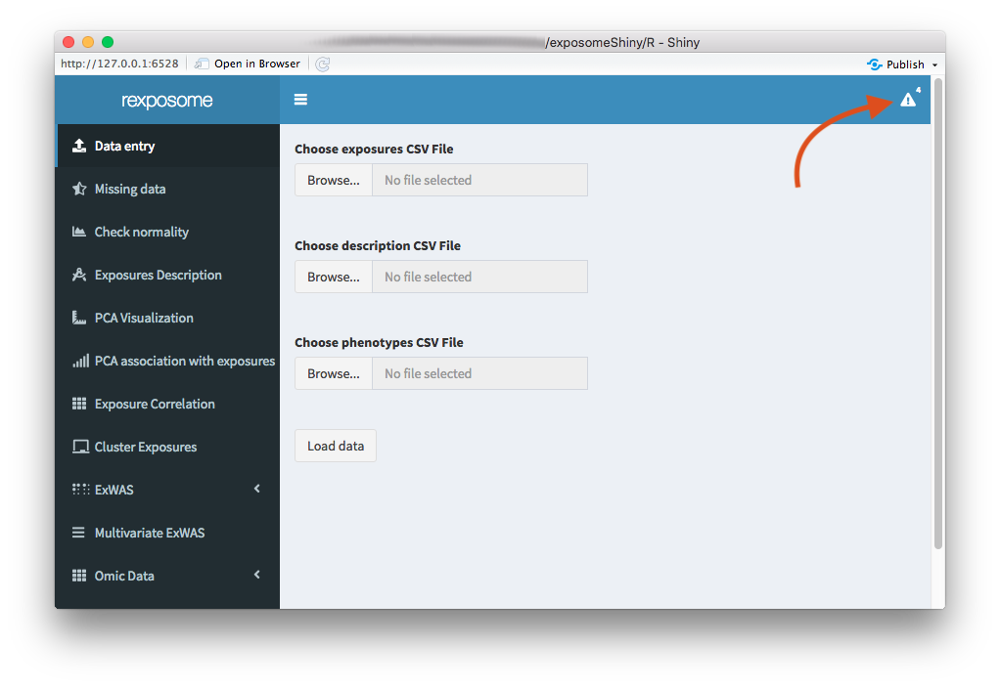
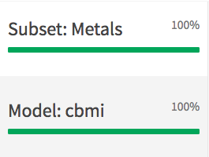

# General application functionalities

This whole Shiny application serves the purpose to perform a various number of exposome and omic analysis with an input set of data. To perform this analysis some operations can performed on the inputed dataset prior to the analysis and so in order to follow track of what exactly has been done or what is loaded on the current session, there's implemented some sort of state tracker inside the Shiny application. In order to access it, press the icon on the top right of the application

When clicking it a dropdown menu appears, inside there are seven different notifications:

  + Exposome dataset: Turns to 100% when an exposome dataset is loaded in the environment. Here's a graphical example.
  

  + LOD imputed: Turns to 100% if the exposome dataset is LOD imputed.
  + Missing imputed: Turns to 100% if the exposome dataset has the missings imputed.
  + Normality corrected: Turns to 100% if the exposome dataset is normality corredted.
  + Omics dataset: Turns to 100% when an omics dataset is loaded in the environment.
  + Subset: Turns to 100% (and displays the subset family(ies)) when the exposome dataset is subseted.
  + Model: Turns to 100% (and displays the association variable(s)) when a model is performed for an omics association analysis. Here's an example of a subset and model information.

