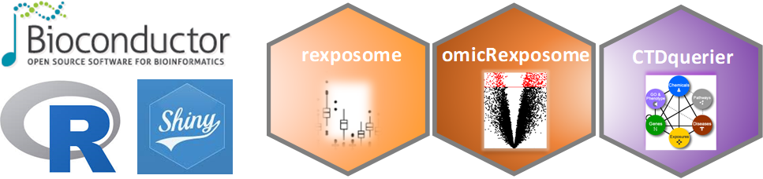

--- 
title: "exposomeShiny User's Guide"
author: "Escribà Montagut, Xavier; González, Juan R."
date: "`r Sys.Date()`"
site: bookdown::bookdown_site
documentclass: book
bibliography: [book.bib, packages.bib]
biblio-style: apalike
link-citations: yes
---

```{r, setup, include=FALSE}
knitr::opts_chunk$set(eval = FALSE)
```

# Overview

{width=50%}


{width=60%}


exposomeShiny is a data analysis toolbox with the following features:

+ Data handling: imputation, LOD, transformation, ...
+ Exposome characterization
+ Exposome-wide association analysis
+ Multivariate association
+ Omic data integration
+ Omic data association
+ Post-omic data analysis: CTD database
+ Post-omic data analysis: Enrichment analysis

To do so, exposomeShiny relies on previously existent Bioconductor packages (rexposome, omicRexposome and CTDquerier among others), it uses them in a seamless way so the final user of exposomShiny can perform the same studies that would conduct using the Bioconductor packages but without writing a single line of code.